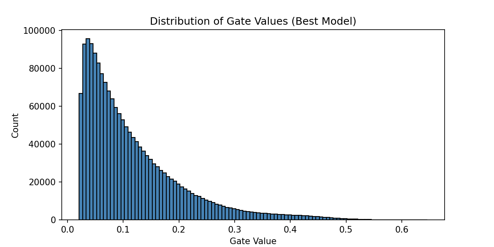

# Report — The Self-Pruning Neural Network

## 1. Why L1 Penalty on Sigmoid Gates Encourages Sparsity

The sparsity loss is the sum of all sigmoid gate values across every PrunableLayer. Since sigmoid is always positive, this is equivalent to the L1 norm of the gates.

L1 has a constant gradient of ±1 regardless of the gate's current value. This means even a gate at 0.001 still gets a full push toward zero — unlike L2 whose gradient vanishes near zero, letting values stagnate at small but nonzero numbers. This is why L1 produces exact zeros rather than just small values.

During training, each gate faces a tug of war: the classification loss tries to keep it open if the weight is useful, the sparsity loss tries to close it regardless. Weights that don't contribute to accuracy lose this competition and get pruned to zero. λ controls how hard the sparsity loss pulls.

---

## 2. Results

| Lambda | Test Accuracy | Sparsity (%) |
|--------|--------------|--------------|
| 1e-5   | 55.75%       | 54.67%       |
| 1e-4   | 55.67%       | 97.93%       |
| 1e-3   | 53.48%       | 99.94%       |
| 1e-2   | 46.31%       | 100.00%      |

Sparsity increases sharply with λ. The most significant result is λ=1e-4 — 97.93% of weights pruned while retaining 55.67% accuracy, nearly identical to the dense baseline. This confirms the vast majority of connections in this network are redundant.

The accuracy drop only becomes meaningful at λ=1e-2 where 100% sparsity collapses the network entirely. The viable pruning range sits between λ=1e-5 and λ=1e-3, offering a clean sparsity-accuracy trade-off.

---

## 3. Gate Value Distribution

The large spike near zero represents the pruned gates — at λ=1e-4 this accounts for 97.93% of all weights. The long tail to the right represents the small fraction of weights the network defended against pruning pressure. The distribution confirms the mechanism is producing a genuine binary outcome: weights are either closed or kept active, not uniformly suppressed.
